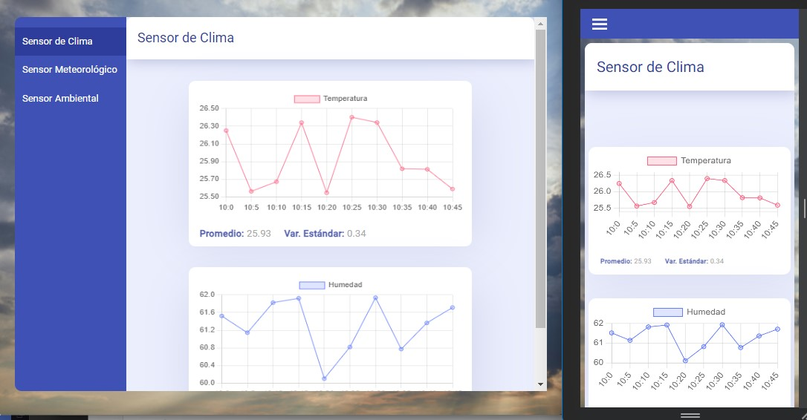

# Weather Monitoring (Frontend)

This website allows in real time shows changing values from weather sensor in graphics, Also providing additional information such average and standard variation.

## URL Web Project
You can access to deployed project [here](https://weather-monitoring-front.netlify.app/). Real time loading graphics only works in this link, not in local environment.

## Real time updating
Until now, the graphics refresh their values each 5 minutes (it will be changed soon in the backend). Only is NOT possible if this project is started in local environment.

## Generated project
This project was generated with [Angular CLI](https://github.com/angular/angular-cli) version 15.1.3.

## Basic login
In this example, I'm not using an entire system of authentication because the focus here is the continuous updating from each sensor. By the way, the email and password are not saved, you can use any email as example.

## limitations
This website is not allowed the use of websocket in local environment, the CORS policy only works with deployed URLs.

## Author
- Cristian Pinzón - [My Portfolio](https://faykris-portfolio.netlify.app/)
- Backend API - [Weather Monitoring](https://weather-monitoring-back.vercel.app/)
